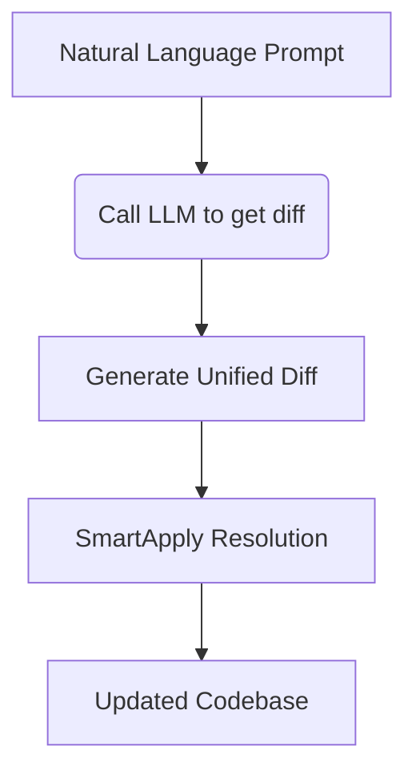

# Core Concepts

## Minimalist Architecture



### Key Principles:
1. **Radical Simplicity** - Single-purpose components with clean interfaces
2. **Context Preservation** - Maintain surrounding code integrity during patches

## SmartApply Mechanics

```python
def smartapply(diff, files):
    for file in parse_diff(diff):
        if file_deletion:
            remove_file(file)
        else:
            original = files.get(file, '')
            # AI-powered conflict resolution, done in parallel
            updated = llm_reconcile(original, file_diff)  
            files[file] = updated
    return files
```

### **Failure Recovery Flow:**
1. Attempt standard `git apply`
   - Uses native git patching first for speed
2. If conflicts detected:
   - Split diff into per-file patches
   - Process each file independently with LLM context
   - Preserve non-conflicting sections
   - Rebuild file from reconciled fragments

## Safety Mechanisms
- **Dry-Run Validation** - Preview changes before application
- **Atomic Operations** - Each file processed independently
- **Context-Aware Patching** - LLM understands code semantics during conflict resolution
- **Strict Idempotence** - Reapplying same diff produces identical result

## Why Agent Loops Work

GPTDiff's architecture makes it uniquely suited for continuous, autonomous improvement:

### Idempotent by Design
Each GPTDiff operation is atomic and self-contained. Running the same prompt twice produces the same result—no cascading failures or state corruption. This makes loops safe to run indefinitely.

### Self-Healing Patches
SmartApply's conflict resolution means patches don't break when code drifts. An agent loop that started yesterday keeps working today, even as other changes land.

### Bounded Blast Radius
Each iteration makes minimal, targeted changes. Unlike batch refactoring tools that touch everything at once, agent loops apply incremental improvements that are easy to review and revert.

### Compound Returns

Each iteration builds on the last. Real example from a test coverage loop:

| Iterations | Test Cases | Time |
|------------|------------|------|
| Start | 18 | 0 hours |
| ~50 | 71 | 4 hours |
| ~100 | 127 | 8 hours |

**Time saved:** What would take a developer 2-3 days of manual test writing completed autonomously overnight.

The same properties that make GPTDiff safe for single patches—atomic operations, context-aware merging, strict idempotence—make it *powerful* when run continuously.

See [Agent Loops](examples/automation.md) for production-ready patterns.
