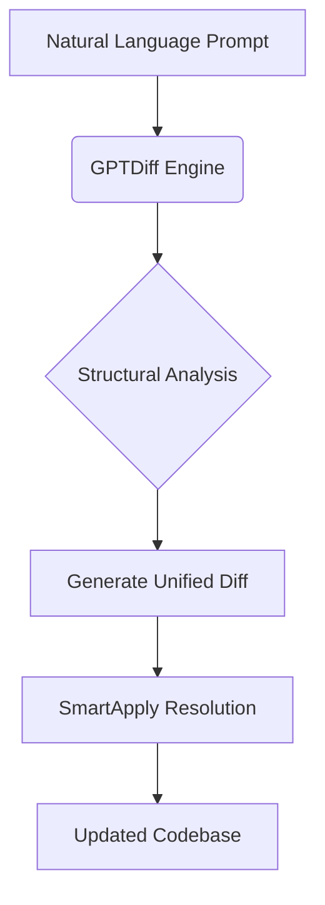

# Core Concepts

## Minimalist Architecture



**Key Principles:**
1. **Radical Simplicity** - Single-purpose components with clean interfaces
2. **Context Preservation** - Maintain surrounding code integrity during patches

## SmartApply Mechanics

```python
def smartapply(diff, files):
    for file in parse_diff(diff):
        if file_deletion:
            remove_file(file)
        else:
            original = files.get(file, '')
            # AI-powered conflict resolution
            updated = llm_reconcile(original, file_diff)  
            files[file] = updated
    return files
```

**Failure Recovery Flow:**
1. Attempt standard `git apply`
2. If conflicts detected:
   - Split diff into per-file patches
   - Process each file independently with LLM context
   - Preserve non-conflicting sections
   - Rebuild file from reconciled fragments

## Safety Mechanisms
- **Dry-Run Validation** - Preview changes before application
- **Atomic Operations** - Each file processed independently
- **Context-Aware Patching** - LLM understands code semantics during conflict resolution
- **Strict Idempotence** - Reapplying same diff produces identical result