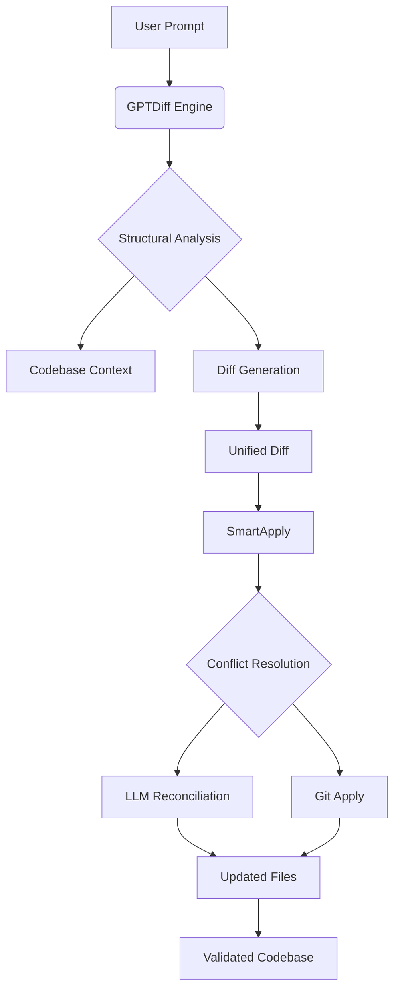
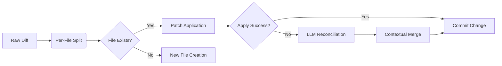

<think>
Okay, let me try to figure out how to apply this diff to the existing architecture.md file. 

First, I need to look at the diff provided. The diff starts with a new file mode, which might be a bit confusing because the user provided the existing file contents. But since the user wants the diff applied to the existing content, I should focus on the changes in the diff.

Looking at the diff, there are two main sections added at the end of the file. 

In the "AI Agent Toolbox Integration" section under "Key Integration Points", after point 2, there's a new point 3: "Error-Resistant Parsing - Handles malformed LLM responses". So I need to add that bullet point there.

Then, there's a new section called "Data Flow Characteristics" with four bullet points:
- Immutable Snapshots
- Isolated Processing
- Deterministic Hashing
- Minimal Context Surfacing

These are added after the AI Agent Toolbox Integration section. 

I need to check the existing file content to see where these changes should go. The original file ends with the AI Agent Toolbox Integration section, specifically the code block for tool definition which ends with an ellipsis. The diff adds the third integration point and then the new Data Flow Characteristics section.

Wait, looking at the original file content provided by the user, the last line in the AI Agent Toolbox Integration section is:

   toolbox.add_tool(name="diff", fn=diff_handler, ...)

And the diff adds a closing ``` for the code block, then adds point 3, and then the new Data Flow Characteristics section. 

Wait, in the original file content, the code block under "Tool Definition" wasn't properly closed. The original ends with:

   ```python
   toolbox.add_tool(name="diff", fn=diff_handler, ...

So the diff is adding the closing ``` and then the third point. Then the new section.

So in the original file, the code block was missing the closing backticks. The diff fixes that by adding the closing ```, then adds the third bullet point under Key Integration Points, and then adds the new Data Flow Characteristics section.

So applying the diff would involve:

1. Closing the code block under Tool Definition with ```
2. Adding the third integration point: "Error-Resistant Parsing..."
3. Adding the new "## Data Flow Characteristics" section with its four bullet points.

I need to make sure that the original file's code block is properly closed. Let me check the original content again.

Original content under "Key Integration Points":

2. **Tool Definition**
   ```python
   toolbox.add_tool(name="diff", fn=diff_handler, ...

It ends with an open code block. The diff adds the closing ``` and then the third point. So in the updated file, after adding the closing ```, the third point is added, and then the new section.

So the corrected part would look like:

2. **Tool Definition**
   ```python
   toolbox.add_tool(name="diff", fn=diff_handler, ...)
   ```
3. **Error-Resistant Parsing** - Handles malformed LLM responses

Then the new section.

So putting it all together, after applying the diff, the file should have the AI Agent Toolbox Integration section with the three integration points, properly closed code blocks, and the new Data Flow Characteristics section at the end.

I need to make sure that all the syntax is correct, especially the code blocks and markdown formatting. Also, ensure that the new sections are added in the correct order.
</think>

# System Architecture

## Component Flow



**Key Architectural Decisions:**
1. **Separation of Concerns** - Clear division between analysis/generation/application
2. **Contextual Safety** - File isolation during patching
3. **Pluggable LLMs** - Model-agnostic through AI Agent Toolbox

## Core Components

### 1. Prompt Engine
- Natural language to structured intent
- Maintains developer persona constraints
- Integrates with AI Agent Toolbox for reliable parsing

```python
# Uses Toolbox for structured output
toolbox = create_toolbox()
toolbox.add_tool("diff", diff_handler)
```

### 2. Diff Generator
- Whole-codebase awareness
- Context-aware change proposals
- Git-compatible output format

**Generation Process:**
1. Environment snapshot creation
2. LLM-based transformation planning
3. Unified diff validation
4. Safety checks via dry-run

### 3. SmartApply System



**Conflict Resolution Logic:**
- Preserves surrounding code context
- Maintains line ending/encoding consistency
- Atomic file operations

## AI Agent Toolbox Integration

### Key Integration Points
1. **Structured Output Parsing**
   ```python
   parser = FlatXMLParser("diff")
   formatter = FlatXMLPromptFormatter(tag="diff")
   ```
2. **Tool Definition**
   ```python
   toolbox.add_tool(name="diff", fn=diff_handler, ...)
   ```
3. **Error-Resistant Parsing** - Handles malformed LLM responses

## Data Flow Characteristics
- **Immutable Snapshots** - Files processed as read-only copies
- **Isolated Processing** - No cross-file contamination during applies
- **Deterministic Hashing** - Content-based change detection
- **Minimal Context Surfacing** - Only relevant code sections shown to LLM