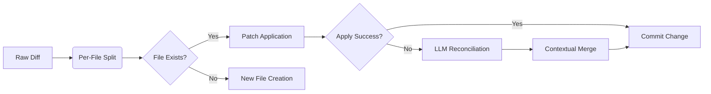

# System Architecture

## Core Components

### **Key Architectural Decisions:**
1. **Clear command line usage** - Easily fit into workflows and agents as a command line program
2. **Contextual Safety** - File isolation during patching
3. **Pluggable LLMs** - Model-agnostic through AI Agent Toolbox
4. **Easy API** - A simple API to use in agent loops

### 1. Prompt Engine

Integrates with AI Agent Toolbox for reliable parsing

```python
# Uses Toolbox for structured output
toolbox = create_toolbox()
toolbox.add_tool("diff", diff_handler)
```

### 2. Diff Generator
- Whole-codebase awareness by default
- Context-aware change proposals
- Git-compatible output format

**Generation Process:**
1. Environment snapshot creation
2. LLM makes diff of environment
3. Diff is applied
4. Validation is run

### 3. SmartApply System



**Conflict Resolution Logic:**
- Preserves surrounding code context
- Maintains line ending/encoding consistency
- Atomic file operations

## AI Agent Toolbox Integration

**Key Components:**
- `FlatXMLParser`: Ensures structured diff output
- `Toolbox`: Manages diff generation and validation

### Key Integration Points
1. **Structured Output Parsing**
   ```python
   parser = FlatXMLParser("diff")
   formatter = FlatXMLPromptFormatter(tag="diff")
   ```
2. **Tool Definition**
   ```python
   toolbox.add_tool(name="diff", fn=diff_handler, ...)
   ```
3. **Error-Resistant Parsing** - Handles malformed LLM responses

