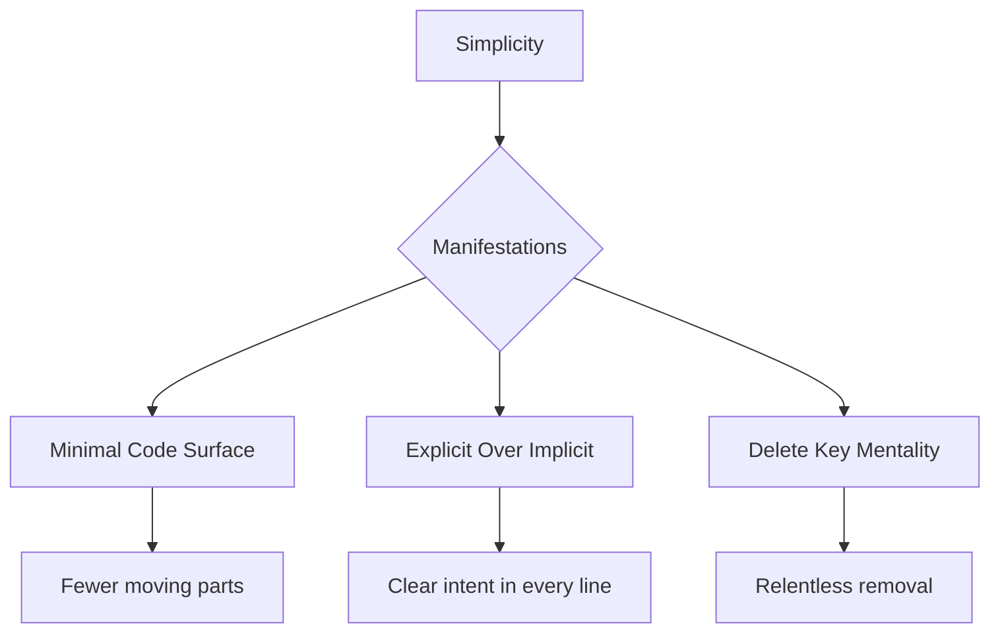

# The Zen of GPTDiff

## Foundational Principles



**Core Tenets:**
1. **Radical Essentialism** - Every line must justify its existence
2. **Idempotence by Design** - Repeatable operations produce identical outcomes
3. **Context Preservation** - Changes respect surrounding code's purpose
4. **Progressive Simplification** - Each iteration reduces complexity

## Architecture Constraints

**The 10x Rule**  
GPTDiff solutions must be at least 10x simpler than alternatives while:
- Handling equivalent workloads
- Maintaining equal reliability
- Providing clearer audit trails

```python
# Bad: Complex abstraction
# Good: Direct expression with context
