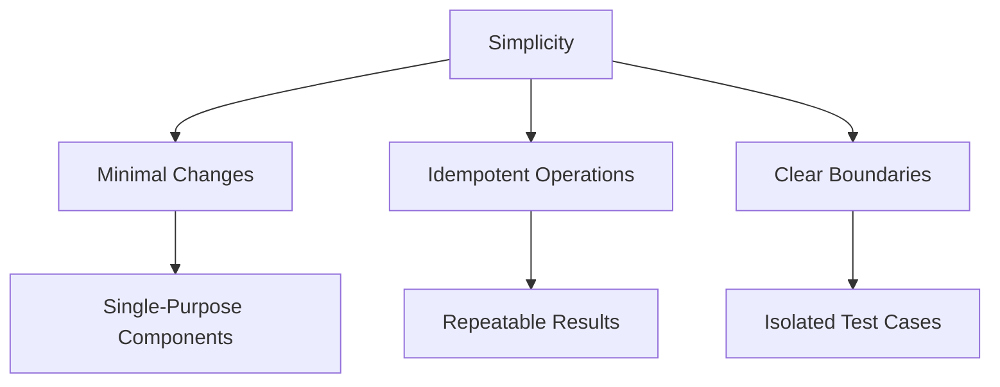

# Contributing to GPTDiff

## Development Philosophy



**Core Principles:**
1. Every change must reduce complexity
2. Preserve backward compatibility in diffs
3. Maintain strict test coverage

## Development Setup

1. **Clone Repository**:
   ```bash
   git clone https://github.com/255BITS/gptdiff.git
   cd gptdiff
   ```

2. **Install Dependencies**:
   ```bash
   pip install -e .[test]
   ```

3. **Run Test Suite**:
   ```bash
   pytest tests/ --cov=gptdiff --cov-report=term-missing
   ```

## Contribution Workflow

1. **Create Feature Branch**:
   ```bash
   git checkout -b feat/new-feature
   ```

2. **Add Tests**:
   - Unit tests for core logic
   - Integration tests for CLI operations
   - Edge case validation

3. **Update Documentation**:
   - Keep API reference current
   - Add examples for new features
   - Maintain conceptual diagrams

4. **Submit Pull Request**:
   - Reference related issues
   - Include test coverage report
   - Document breaking changes

## Code Standards
- **Simplicity First**: Maximum 3 levels of indentation
- **Type Annotated**: 100% type coverage in public APIs
- **Docstrings**: Google-style with examples
- **Testing**: 90%+ line coverage maintained