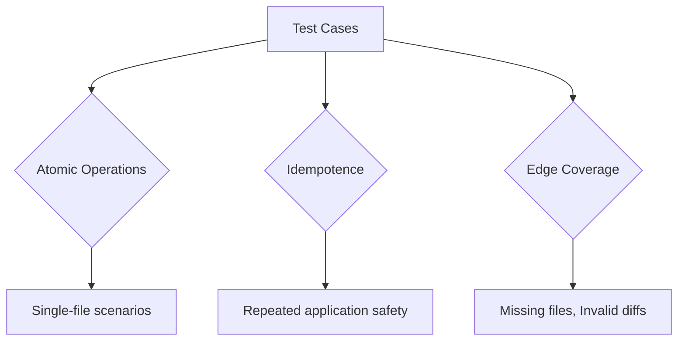

# Testing Philosophy & Practices

## Core Testing Principles



**Guarantees Across All Tests:**
- Zero cross-test contamination
- Pure functions with no side effects
- Deterministic results across runs

## Key Test Categories

### File Operations
```python
# tests/test_smartapply.py
def test_smartapply_file_deletion():
    """Verify clean removal without residual artifacts"""
    # Tests deletion idempotency and missing file safety

def test_smartapply_new_file_creation():
    """Validate file initialization from diffs"""
    # Ensures proper handling of /dev/null sources
```

### Complex Modifications
```python
def test_smartapply_complex_single_hunk(mocker):
    """Test multi-line changes with context preservation"""
    # Validates LLM mock integration and structural understanding
```

## Running the Test Suite

```bash
# Install development dependencies
pip install -e .[test]

# Run all tests with coverage
pytest tests/ --cov=gptdiff --cov-report=term-missing

# Target specific test cases
pytest tests/test_smartapply.py -k "test_smartapply_file_modification"
```

## Writing New Tests

1. **Isolate Scenarios**: One logical case per test
2. **Mock LLM Responses**: Use `@patch` for deterministic outcomes
3. **Verify Idempotence**: Reapply same diff multiple times
4. **Check Boundaries**: Empty files, invalid paths, encoding issues