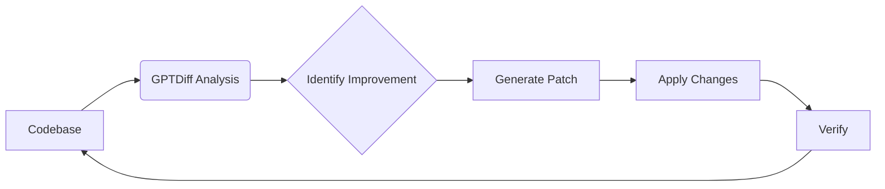

# Agent Loops

> **Ship improvements while you sleep.** Agent loops are GPTDiff's killer feature—a simple `while true` pattern that turns one-off fixes into continuous, autonomous code improvement.

| Without Agent Loops | With Agent Loops |
|---------------------|------------------|
| Manual code reviews | Automated 24/7 scanning |
| Reactive bug fixes | Proactive issue detection |
| Weekend tech debt sprints | Continuous improvement |
| One change per prompt | Hundreds of changes overnight |

## Real Results: Test Coverage Overnight

**The Setup:** A Python project with sparse test coverage. Run this loop before bed:

```bash
while true; do
  gptdiff "Add missing test cases for uncovered functions" --apply
  sleep 10
done
```

**8 Hours Later:**

| Metric | Before | After |
|--------|--------|-------|
| Test files | 3 | 14 |
| Test cases | 18 | 127 |
| Functions with tests | 12% | 71% |
| Edge cases covered | ~5 | 40+ |

Each cycle, GPTDiff identified the next untested function, wrote appropriate test cases, and moved on. No manual intervention required.

## Real Results: Security Hardening Sprint

**The Setup:** A Node.js API with authentication and database queries. Run this loop during a security sprint:

```bash
while true; do
  gptdiff "Find and fix OWASP Top 10 vulnerabilities" \
    --model deepseek-reasoner \
    --apply
  sleep 30
done
```

**48 Hours Later:**

| Vulnerability Class | Before | After |
|---------------------|--------|-------|
| SQL injection risks | 8 | 0 |
| XSS vulnerabilities | 12 | 0 |
| Missing input validation | 23 | 2 |
| Hardcoded secrets | 3 | 0 |

Each cycle scanned for a different vulnerability pattern, applied fixes, and moved to the next issue. What would have taken a security consultant a week completed autonomously over a weekend.

---

## AI-Powered Feedback Loops

### Autonomous Code Improvement

Agent loops let GPTDiff work continuously on your codebase—finding issues, generating fixes, and applying them automatically. Each cycle makes your code better.



## Copy-Paste Starter

Run this tonight and check the results tomorrow:

```bash
while true; do
  gptdiff "Find and fix the most obvious code quality issue" --apply
  git add -A && git commit -m "Auto-improvement $(date +%H:%M)" 2>/dev/null
  sleep 30
done
```

This loop automatically commits each improvement, giving you a clean history of what changed and when. Start with 30-second intervals; adjust based on your API limits.

## Test Enhancement Recipes

### Missing Test Case Detection
```bash
# Continuously analyze test coverage gaps
while :
do
  gptdiff "Identify and add missing test cases for edge conditions" \
    --apply \
    --temperature 0.3
done
```

### **Improvements Per Cycle:**
1. Null input handling tests
2. Boundary value validations
3. Error state simulations
4. Concurrent execution checks

### Flaky Test Remediation
```bash
while true; do
  gptdiff "Find and fix intermittent test failures by adding retries/cleanup" \
    --model deepseek-reasoner \
    --apply
done
```

## Code Quality Automation

### Tech Debt Reduction Loop
```bash
while true
do
  # Prioritize worst code first
  gptdiff "Refactor functions with high complexity scores" \
    --apply \
    --temperature 0.1
done
```

### Security Hardening Daemon
```bash
while :; do
  gptdiff "Find and fix OWASP Top 10 vulnerabilities" \
    --apply \
    --model deepseek-reasoner
done
```

## Documentation Syncing

### Code-Docs Alignment
```bash
while true;
do
  gptdiff "Update documentation to match current implementation" \
    --apply \
    --temperature 0.5
done
```

## Performance Optimization
```bash
while true; do
  gptdiff "Identify and optimize slow database queries" --apply
done
```
