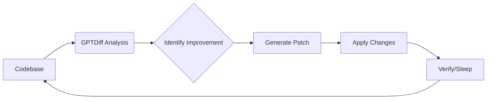

# Continuous Improvement Automation

## AI-Powered Feedback Loops


## Core While Loop Pattern
```bash
while true; do
  gptdiff "<improvement-prompt>" --apply
  sleep 300  # 5 minute cooldown
done
```

## Test Enhancement Recipes

### Missing Test Case Detection
```bash
# Continuously analyze test coverage gaps
while :
do
  gptdiff "Identify and add missing test cases for edge conditions" \
    --files tests/ \
    --apply \
    --temperature 0.3
  sleep 600  # Check every 10 minutes
done
```

**Improvements Per Cycle:**
1. Null input handling tests
2. Boundary value validations
3. Error state simulations
4. Concurrent execution checks

### Flaky Test Remediation
```bash
while sleep 120; do
  gptdiff "Find and fix intermittent test failures by adding retries/cleanup" \
    --model deepseek-reasoner \
    --apply
done
```

## Code Quality Automation

### Tech Debt Reduction Loop
```bash
while true
do
  # Prioritize worst code first
  gptdiff "Refactor functions with high complexity scores" \
    --apply \
    --temperature 0.1
  sleep 900  # 15 minute intervals
done
```

### Security Hardening Daemon
```bash
while :; do
  gptdiff "Find and fix OWASP Top 10 vulnerabilities" \
    --files src/ \
    --apply \
    --model deepseek-reasoner
  sleep 1800  # Scan every 30 minutes
done
```

## Documentation Syncing

### Code-Docs Alignment
```bash
while sleep 300
do
  gptdiff "Update documentation to match current implementation" \
    --files src/ docs/ \
    --apply \
    --temperature 0.5
done
```

## Performance Optimization
```bash
while true; do
  gptdiff "Identify and optimize slow database queries" --apply
  sleep 7200  # 2 hour cycles
