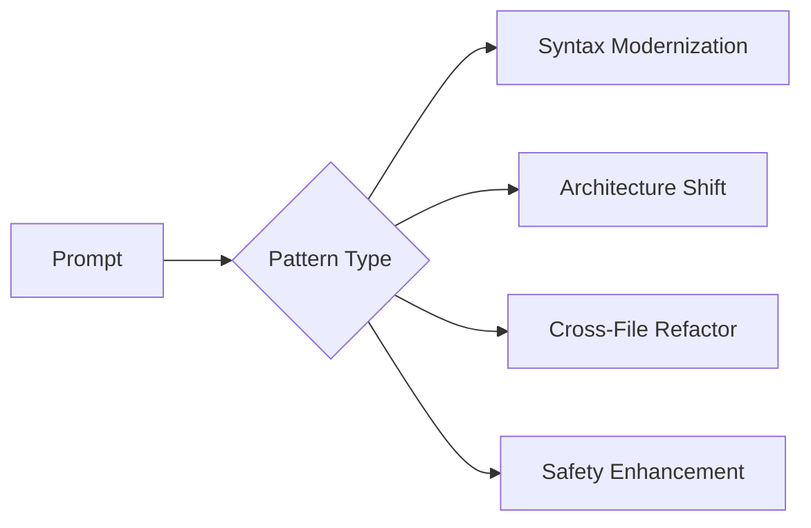

# Transformation Recipes

## Common Code Evolution Patterns



## Modernization Recipes

### Python 2 → 3 Conversion
```bash
gptdiff "Convert code to Python 3 syntax" \
    --files src/ \
    --apply \
    --temperature 0.2
```
**Handles:**
- Print statements → functions
- Unicode literals
- xrange → range
- Dictionary view methods

### Type Hint Adoption
```python
# Before
def process(items):
    return [i*2 for i in items]

# After 
def process(items: list[int]) -> list[int]:
    return [i*2 for i in items]
```
```bash
gptdiff "Add Python type hints" \
    --model deepseek-reasoner \
    --apply
```

## Security Recipes

### SQL Injection Protection
```bash
gptdiff "Replace string formatting with parameterized queries" \
    database/ \
    --apply
```
**Transforms:**
```python
# Before
cursor.execute(f"SELECT * FROM users WHERE id = {user_id}")

# After
cursor.execute("SELECT * FROM users WHERE id = %s", (user_id,))
```

### Secrets Management
```bash
gptdiff "Move hardcoded credentials to environment variables" \
    config/ \
    --call > secrets.patch
```

## Performance Recipes

### Loop Optimization
```bash
gptdiff "Convert nested loops to vectorized operations" \
    --files data_processing.py \
    --apply
```

### Cache Integration
```bash
gptdiff "Add LRU caching to expensive pure functions" \
    --model deepseek-reasoner \
    --temperature 0.5
```

## Framework Migration

### Django → FastAPI Transition
```bash
gptdiff "Convert Django views to FastAPI routers with Pydantic models" \
